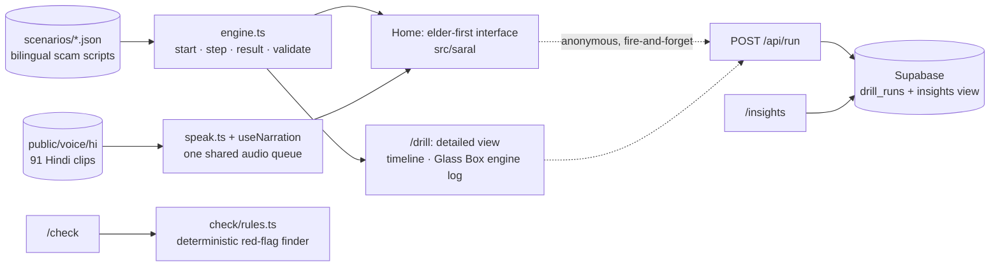

# Chaukas (चौकस) — a scam fire-drill your parents can actually use


**Get scammed here, so you never are out there.** · **यहाँ फँसिए, ताकि बाहर कभी न फँसें।**

**Live:** https://chaukas.vercel.app  ·  **Judging?** [/judge](https://chaukas.vercel.app/judge)  ·  **Live numbers:** [/insights](https://chaukas.vercel.app/insights)  ·  **Detailed view:** [/drill](https://chaukas.vercel.app/drill)  ·  **Check a message:** [/check](https://chaukas.vercel.app/check)

Built in one day for **HACKDAY 1.0** (DECODEP) · 20 September 2026 · Theme: *Tech for a Better Tomorrow*

---

## In 30 seconds

- **The problem:** most UPI-fraud victims are not hacked. Under fear and hurry, they *send the money themselves*, even when they know the rule.
- **The idea:** stop building detectors. Let people **practise the moment** in a safe sandbox: a pretend scammer calls, pressures you, and a PIN pad appears. What you *do* is what gets measured.
- **Who it is for:** the people scammers target most. The home page is Hindi-first and **voice-guided**: a guide called *चौकस दीदी* explains every screen, reads every message aloud, and reads out every choice. One thing per screen, big numbered buttons, no timers, no jargon.

<!-- SCREENSHOTS: add these four PNG files to docs/screens/ (names must match). If you cannot add them, delete this whole table. -->
| Home | A message, read aloud | The PIN moment | The lesson |
|---|---|---|---|
|  |  |  |  |

## The problem

UPI-related fraud in India: **13.42 lakh incidents worth ₹1,087 crore** in FY 2023-24, **12.64 lakh incidents worth ₹981 crore** in FY 2024-25, and **10.64 lakh incidents worth ₹805 crore** in FY 2025-26 up to November (Ministry of Finance reply in the Lok Sabha, reported 15 December 2025).

The payment systems are not being broken. **The victim authorises the payment.** The scammer supplies three things, which the Prime Minister himself listed when warning the country about "digital arrest": personal details, fear, and time pressure. In that state, people type the PIN or read out the OTP that they would never share on a calm day.

So the gap is not knowledge. It is **behaviour under pressure**, and nobody gives people a place to rehearse it. We hold fire drills because people who "know" where the exit is still freeze.

## What Chaukas does

Three practices, each two to three minutes:

| Practice | The scam | The trap |
|---|---|---|
| The buyer who never bargains | "Scan this QR and enter your PIN to *receive* ₹4,500" | A PIN pad whose small print says **Paying** |
| Your power will be cut tonight | SMS → call → "install this app" → OTP | Screen-sharing permission, then the OTP |
| You are under digital arrest | Courier IVR → "inspector" on video call → "RBI verification account" | Transferring money to prove innocence |

For each one the user answers **one yes/no question** first (what they *know*), then lives through the scam (what they *do*), then gets a **lesson**: the scammer's own lines are replayed and each trick is named, followed by the one rule to remember and what to do if it ever happens for real (call **1930**, then the bank).

At the end: how many times they stayed safe, a gentle note if they *knew the rule and still fell*, and one button to **send it to family on WhatsApp**. Children forwarding it to parents is the distribution plan.

## What changed at 2 pm, and why it matters

The first interface was a phone simulator with a timeline replay and a live engine log. Testers, **including developers, found it too complex**. If a developer hesitates, a 65-year-old cannot use it at all. So the front door was rebuilt around ten rules:

1. Hindi first on every visit; English is one tap away.
2. A guide voice explains every screen, with captions always visible.
3. One thing per screen; the main button is always at the bottom, never below the fold.
4. Buttons are full-width and at least 64px tall; choices carry a big 1 / 2 / 3 badge that matches the spoken "पहला, दूसरा, तीसरा".
5. Text is 20px or larger. No capitals, no jargon, no English-only labels.
6. A calm, familiar look, and choices are never colour-coded.
7. No timers or countdowns. The pressure comes from the scammer's words and voice, as in real life.
8. It is always obvious who is speaking: the guide (green bubble) or the other person (white bubble).
9. A permanent chip says "यह अभ्यास है, असली नहीं" (this is practice, not real).
10. Any tap stops the voice at once, and "🔊 फिर से सुनें" (hear again) is on every screen.

It starts with a **sound check** ("can you hear me?"), because an elder's phone is often on silent. After each practice it asks "one more, or enough for today?", so nobody is forced through all three. The helpline number is shown as text and is deliberately **not** a tappable call link.

The original interface is still there as the **detailed view** at [/drill](https://chaukas.vercel.app/drill) for anyone who wants the timeline and the engine log.

## The one number

**Knowledge–Behaviour Gap:** of the people who answered the rule correctly, the share who still fell for that scam on their first attempt. It is computed live from anonymous runs and always shown with its sample size at [/insights](https://chaukas.vercel.app/insights). It is a self-selected hackathon sample, not a representative study, and the page says so.

## Evaluate it in two minutes

1. Open the [home page](https://chaukas.vercel.app) on a phone, **sound on**. Tap ▶ शुरू करें and let the guide take you through the first practice. Go along with the buyer.
2. Open [/drill](https://chaukas.vercel.app/drill?only=olx-qr) on a laptop to see the same practice with the **engine log** streaming beside it.
3. Paste a spam SMS from your own phone into [/check](https://chaukas.vercel.app/check).
4. Open [/insights](https://chaukas.vercel.app/insights) for the live numbers.
5. Clone the repo and run `npm test`.

| Judging criterion | Where to look |
|---|---|
| Problem & Impact | This README's problem section · the live gap on /insights · the family-forwarding loop |
| Innovation | Behaviour measured by real keypad traps, not quiz answers · voice-guided elder-first flow · lesson built from the lines the user actually heard |
| Technical implementation | `src/engine/engine.ts` (pure, deterministic) · scenario linter + bot players in `tests/` · CI badge · `/drill` engine log |
| User experience | The home page, on a phone, with sound |
| Feasibility & Scalability | "Add a new scam" below · static hosting · works with every network call failing |

## How it works



- **Deterministic core.** A pure TypeScript engine decides every outcome from what the user actually did: typed the PIN, shared the OTP, allowed the app. No AI sits in that path, so every user and every judge gets the same explainable result, instantly and offline. Two interfaces run on the same engine, which is the proof that logic and presentation are cleanly separated.
- **Scenarios are data.** Each scam is one JSON file. `validate()` proves in CI that every scenario has a scam ending, a safe exit from every node, both languages, and at least three red flags. Two bot players, the most gullible and the most careful person possible, play every scenario on every push.
- **Voice that works everywhere.** Browser Hindi voices are unreliable (some browsers ship none), so all 91 Hindi lines are pre-generated clips played through one shared audio queue, with browser speech as the English fallback and captions as the fallback for silence.
- **Nothing in the core needs a server.** Block every network request after the first load and all three practices still complete. Telemetry, insights and audio are optional layers that fail silently.
- **`/check`** is a small, tested rules engine (scam recall 12/12 and false alarms 0/12 on the fixtures, which include genuine bank OTP messages). Its best verdict is "no red flags found", never "safe".

**Stack:** Next.js (App Router) · TypeScript · Tailwind CSS · Supabase (Postgres) · Vercel · GitHub Actions.

## Add a new scam in about twenty minutes

1. Copy a file in `src/scenarios/`, write the nodes, messages, choices and endings in English and Hindi, and tag the red flags.
2. Add it to `src/scenarios/index.ts`.
3. Run `npm test`. The linter rejects broken graphs, missing translations, dead ends and scenarios a careful player cannot escape.
4. Optional: drop Hindi clips into `public/voice/hi/` using the naming scheme in `docs/SARAL_UI_SPEC.md`. Missing clips fall back to browser speech.

No component changes. That is the scaling path: new scams, new languages, and embedding the same engine inside a bank's or an NGO's onboarding.

## Privacy and safety

- Chaukas **never asks for a real PIN, OTP, phone number or bank**. Users get a practice PIN, shown on screen.
- Digits typed on a keypad **never leave the keypad component**. The engine's `Action` type only accepts their *length*. Nothing is stored, logged or sent.
- Telemetry is anonymous: scenario, outcome, timings, language, and whether the rule was known. No name, phone, email or IP column exists. The table has row-level security with no public policies; only the server can write.
- Every simulated screen is marked as practice, and no real app's branding is imitated.
- The scam scripts contain nothing beyond what public advisories already describe.

## Run it

```bash
npm install
npm run dev        # http://localhost:3000
npm test           # scenario linter + bot players + message-checker fixtures
npm run build
```

Node 22.6 or newer. Telemetry is optional: copy `.env.example` to `.env.local`, add a Supabase URL and secret key, and run `supabase/schema.sql`. Without them the app runs normally and records nothing.

## Project map

```
src/engine/engine.ts      pure drill engine, scoring, scenario linter
src/scenarios/            the three scams as bilingual JSON
src/saral/                the elder-first, voice-guided interface (home page)
src/app/drill/            the detailed view: timeline replay + Glass Box engine log
src/check/rules.ts        deterministic red-flag finder behind /check
src/lib/speak.ts          shared audio queue, clip playback, speech fallback
src/app/api/              /api/run (telemetry in) and /api/insights (aggregates out)
public/voice/hi/          91 Hindi clips: guide, callers, every message, every choice
tests/                    bot players, graph validation, checker fixtures
docs/                     PRD.md · SARAL_UI_SPEC.md · VOICE_CREDITS.md
supabase/schema.sql       one table, one view, locked down
```

## Honest limits

| Part | Status |
|---|---|
| Engine, scenario linter, scoring, tests | Works as described |
| Three scenarios | Follow public advisories; not yet reviewed by a cyber-crime cell or a bank fraud team |
| Elder-first interface | Built and tested in one afternoon with a handful of people; needs proper sessions with older users |
| Voices | Synthetic placeholders under non-commercial licences (`docs/VOICE_CREDITS.md`); to be replaced by voice actors |
| Insights | Self-selected sample, soft rate limiting |
| `/check` | A small rules engine; it misses unusual phrasing by design |
| "Video call" | An avatar and captions, no real video |
| Long-term fraud reduction | **Not claimed.** Research shows short interventions reduce susceptibility and that one-off training fades, which is why re-practice and family forwarding exist. A follow-up study is the next step |

**Next:** Punjabi and other languages · recorded human voices · an assisted mode for a child sitting beside a parent · more scams (AI voice-clone "family emergency", fake customer care) · a monthly reminder to practise again · partner pilots with banks, RWAs and cyber cells.

## Sources

- UPI fraud figures, Lok Sabha reply (Dec 2025): [The420](https://the420.in/india-upi-fraud-data-fy26-parliament-digital-payments/) · [Madhyamam](https://madhyamamonline.com/india/upi-linked-frauds-amount-to-rs-805-crore-far-fy26-govt-1477281)
- I4C advisory, agencies do not arrest over video call: [The Tribune](https://www.tribuneindia.com/news/india/cbi-ed-dont-nab-via-video-calls-advisory-to-curb-digital-arrest/)
- "No digital arrest in law; stop, think, take action", Mann Ki Baat, 27 Oct 2024: [Deccan Chronicle](https://deccanchronicle.com/nation/modi-do-not-get-digitally-arrested-1833524)
- PIN requests to "receive" money as a red flag: [PhonePe Business](https://business.phonepe.com/articles/fake-upi-payment-scams-how-to-identify-and-prevent-fraud)
- Burke, Kieffer, Mottola & Perez-Arce, *Can Educational Interventions Reduce Susceptibility to Financial Fraud?* ([PDF](https://gflec.org/wp-content/uploads/2021/04/Burke-Kieffer-Mottola-Perez-Arce-Can-Educational-Interventions-Reduce-Susceptibility-to-Financial-Fraud-CB2021.pdf))
- *Training consumers to detect digital imposter scams*, Journal of Financial Crime, 2025 ([link](https://www.emerald.com/jfc/article/32/1/77/1243133/What-does-trust-have-to-do-with-it-Training))
- ShieldUp!, an inoculation game for the Indian scam landscape ([arXiv 2503.12341](https://arxiv.org/html/2503.12341)) · ScamPilot ([arXiv 2601.22426](https://arxiv.org/html/2601.22426))

Product reasoning, landscape and decisions: [`docs/PRD.md`](docs/PRD.md). The elder-first design brief: [`docs/SARAL_UI_SPEC.md`](docs/SARAL_UI_SPEC.md).

## How this was built

Built on 20 September 2026 inside the HACKDAY 1.0 window, with AI coding assistance (Claude for the spec, engine, scenarios, voice pipeline and code review; an AI coding agent for the interface). Every file was run, tested and reviewed by the author, and the commit history shows the day's progression, including the afternoon rebuild after user testing.

**If you or someone you know is targeted: call 1930 immediately and report at cybercrime.gov.in.**
