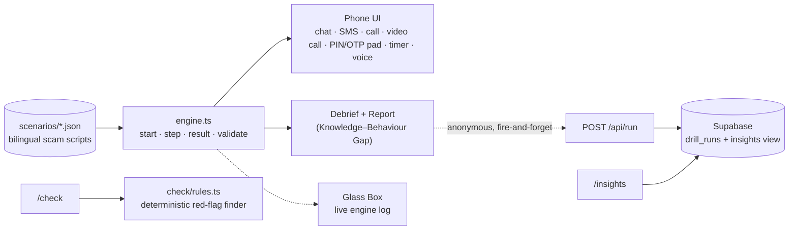

# Chaukas (चौकस) — India's scam fire-drill


**Get scammed here. Never out there.**

Live: **https://chaukas.vercel.app** · Judging? Start at **[/judge](https://chaukas.vercel.app/judge)** · Live numbers: **[/insights](https://chaukas.vercel.app/insights)**

Built solo in 8 hours for **HACKDAY 1.0** (DECODEP), 20 September 2026 · Theme: *Tech for a Better Tomorrow*

---

## The problem

UPI-related fraud in India: 13.42 lakh incidents worth ₹1,087 crore in FY 2023-24, 12.64 lakh incidents worth ₹981 crore in FY 2024-25, and 10.64 lakh incidents worth ₹805 crore in FY 2025-26 up to November (Ministry of Finance reply in the Lok Sabha, reported 15 Dec 2025).

Most of that money is not stolen by breaking a system. **The victim authorises the payment.** They are frightened, rushed and told to keep it secret, and under that pressure they type the PIN or read out the OTP, even though most of them *know* the rule.

Everyone builds scam **detectors**. A warning does not help someone who has already been talked into cooperating. The gap is not knowledge. It is **behaviour under pressure**, and nobody lets people practise that.

## What Chaukas does

A 3-minute, no-login simulator. Your "phone" rings, a scammer pressures you, a PIN pad appears.

1. **Three quick yes/no questions** record what you *know*.
2. **Three drills** record what you *do*, with a practice wallet and a practice PIN:
   - the buyer who asks you to scan a QR and enter your PIN to "receive" money
   - the "your electricity will be cut tonight" SMS → call → screen-sharing app → OTP
   - the "digital arrest" video call
3. **Debrief** after every drill: the conversation is replayed with each red flag pinned to the message that carried it, the one rule to remember, and what to do if it happens for real (1930, cybercrime.gov.in, your bank, Sanchar Saathi).
4. **Report**: Knowledge vs Behaviour. If you answered correctly and still typed the PIN, it says so.
5. **Send it to your parents** with one tap. Children are the channel to the people scammers target most.

There is also **/check**: paste a suspicious SMS or WhatsApp message, see the red flags highlighted, and practise that exact scam.

## The one number

**Knowledge–Behaviour Gap** = of the people who answered the rule correctly, the share who still fell for the scam on their first attempt. It is computed live from anonymous runs and shown with its sample size on [/insights](https://chaukas.vercel.app/insights). It is a self-selected hackathon sample, not a representative study, and the page says so.

## How it works



- **Deterministic core.** A pure TypeScript engine decides every outcome from what you actually did (typed the PIN, shared the OTP, allowed the app). No AI sits in that path, so every player and every judge gets the same, explainable result, offline.
- **Scenarios are data.** Each scam is one JSON file. `validate()` proves in CI that every scenario has a scam ending, a safe exit from every node, both languages and at least three red flags. Adding a new scam is a content task, not a code task.
- **The core drill needs no backend.** Telemetry, insights and voice are optional layers. Block every network request after the page loads and all three drills still complete.
- **Voices.** Hindi caller lines are pre-generated clips (phone-line filtered) so they sound the same on every device; browser text-to-speech is the fallback.

**Stack:** Next.js (App Router) · TypeScript · Tailwind CSS · Supabase (Postgres) · Vercel · GitHub Actions.

## Privacy and safety

- Chaukas **never asks for a real PIN, OTP, phone number or bank**. You get a practice PIN.
- Digits typed on the keypad **never leave the keypad component**. The engine's `Action` type only accepts their *length*. Nothing is stored, logged or sent.
- Telemetry is anonymous: scenario, outcome, timings, language. No name, phone, email or IP column exists. The table has row-level security with no public policies; only the server can write.
- Every simulated screen carries a **SIMULATION** watermark, and no real app's branding is imitated.
- Scam scripts contain nothing beyond what public advisories already describe.

## Run it

```bash
npm install
npm run dev        # http://localhost:3000
npm test           # scenario linter + bot players + message-checker fixtures
npm run build
```

Requires Node 22.6 or newer. Telemetry is optional: copy `.env.example` to `.env.local` and fill in a Supabase URL and secret key, then run `supabase/schema.sql`. Without them the app runs normally and simply records nothing.

`npm test` plays every scenario with two bots, the most gullible and the most careful player possible, and checks that the first is always scammed and the second always walks away clean. It also runs the message checker against labelled scam and genuine messages (including real bank OTP texts, which must **not** be flagged).

## Honest limits (Reality Ledger)

| Part | Status |
|---|---|
| Engine, scenario linter, scoring, tests | Works as described |
| Three scenarios | Follow public advisories; not yet reviewed by a cyber-crime cell or bank fraud team |
| Phone screens | Generic skins in one frame |
| Voices | Synthetic placeholders under non-commercial licences (see `docs/VOICE_CREDITS.md`); replace with voice actors |
| Insights | Self-selected sample, soft rate limiting |
| /check | A small rules engine: it misses unusual phrasing, and its best verdict is "no red flags found", never "safe" |
| "Video call" | Avatar and backdrop, no real video |
| Long-term fraud reduction | **Not claimed.** Research shows short interventions reduce susceptibility and that one-off training fades, which is why re-drills and family forwarding exist. A follow-up study is the next step |

## Sources

- UPI fraud figures, Lok Sabha reply (Dec 2025): [The420](https://the420.in/india-upi-fraud-data-fy26-parliament-digital-payments/) · [Madhyamam](https://madhyamamonline.com/india/upi-linked-frauds-amount-to-rs-805-crore-far-fy26-govt-1477281)
- I4C advisory, agencies do not arrest over video call: [The Tribune](https://www.tribuneindia.com/news/india/cbi-ed-dont-nab-via-video-calls-advisory-to-curb-digital-arrest/)
- "No digital arrest in law — Stop, Think, Take Action", Mann Ki Baat, 27 Oct 2024: [Deccan Chronicle](https://deccanchronicle.com/nation/modi-do-not-get-digitally-arrested-1833524)
- PIN requests to "receive" money as a red flag: [PhonePe Business](https://business.phonepe.com/articles/fake-upi-payment-scams-how-to-identify-and-prevent-fraud)
- Burke, Kieffer, Mottola & Perez-Arce, *Can Educational Interventions Reduce Susceptibility to Financial Fraud?* ([PDF](https://gflec.org/wp-content/uploads/2021/04/Burke-Kieffer-Mottola-Perez-Arce-Can-Educational-Interventions-Reduce-Susceptibility-to-Financial-Fraud-CB2021.pdf))
- *Training consumers to detect digital imposter scams*, Journal of Financial Crime, 2025 ([link](https://www.emerald.com/jfc/article/32/1/77/1243133/What-does-trust-have-to-do-with-it-Training))
- ShieldUp!, an inoculation game for the Indian scam landscape ([arXiv 2503.12341](https://arxiv.org/html/2503.12341)) · ScamPilot ([arXiv 2601.22426](https://arxiv.org/html/2601.22426))

Full product reasoning, landscape and decisions: [`docs/PRD.md`](docs/PRD.md).

## How this was built

Built on 20 September 2026 inside the HACKDAY 1.0 window, with AI coding assistance (Claude for the spec, engine and review; an AI coding agent for the UI). Every file was run, tested and reviewed by the author. The commit history shows the day's progression.

**If you or someone you know is targeted:** call **1930** immediately and report at **cybercrime.gov.in**.
