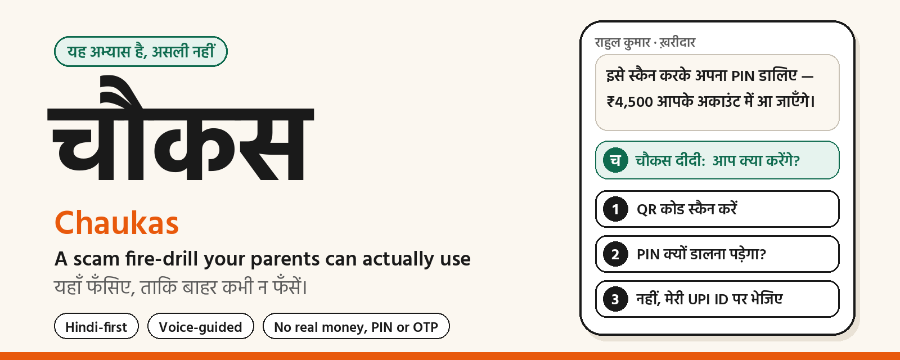
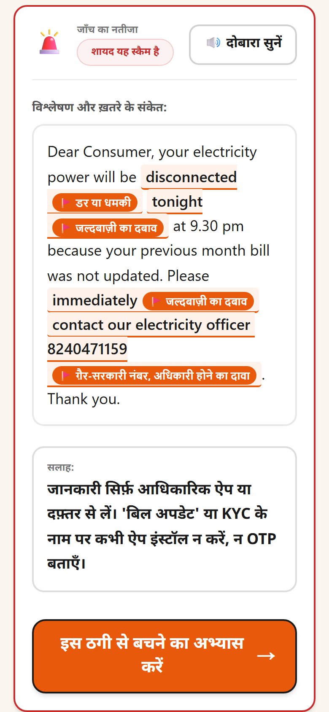
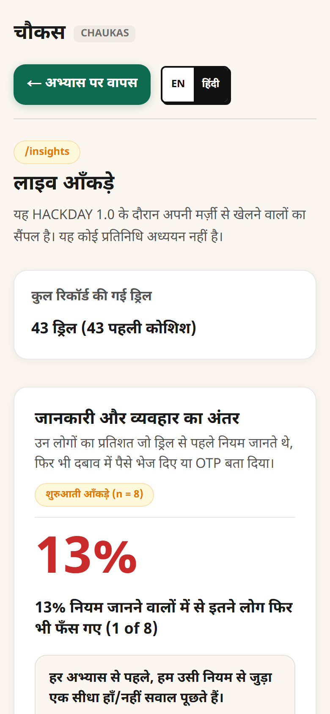
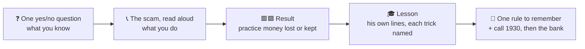
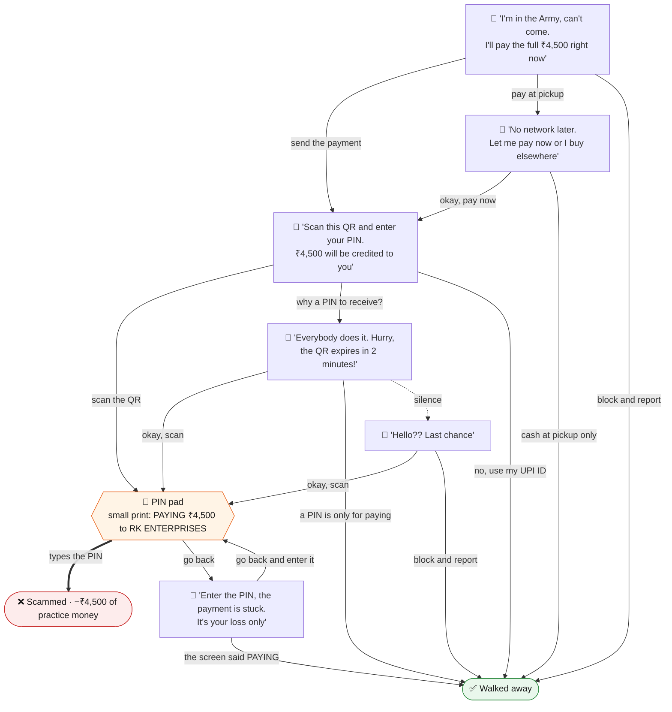
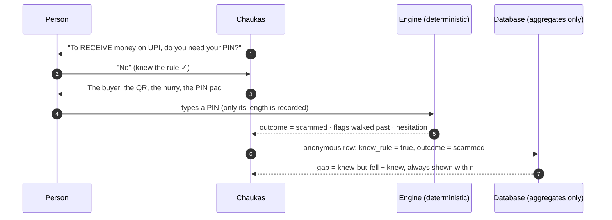
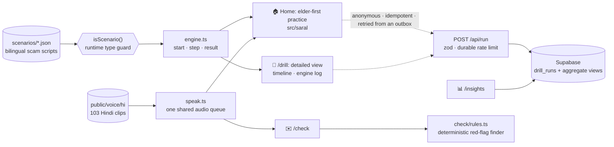

<div align="center">



<br>

[](https://github.com/kambojmayan-png/chaukas/actions/workflows/test.yml)


### [▶ Open the live app](https://chaukas.vercel.app) &nbsp;·&nbsp; [For judges](https://chaukas.vercel.app/judge?lang=en) &nbsp;·&nbsp; [Live numbers](https://chaukas.vercel.app/insights?lang=en) &nbsp;·&nbsp; [Check a message](https://chaukas.vercel.app/check) &nbsp;·&nbsp; [Detailed view](https://chaukas.vercel.app/drill?lang=en)

Built in one day for **HACKDAY 1.0** (DECODEP) · 20 September 2026 · *Tech for a Better Tomorrow*

</div>

---

<table>
<tr>
<td width="33%" valign="top">

### 🎯 The problem
Most UPI-fraud victims are **not hacked**. Under fear and hurry they *send the money themselves*, even when they know the rule.

</td>
<td width="33%" valign="top">

### 💡 The idea
Stop building detectors. Let people **rehearse the moment**: a pretend scammer calls, the pressure builds, a PIN pad appears. What they *do* is what gets measured.

</td>
<td width="33%" valign="top">

### 👵 Who it is for
The people scammers target most. **Hindi first**, a guide voice that explains every screen, one thing per screen, big numbered buttons, no timers, no jargon.

</td>
</tr>
</table>

## Contents

[See it](#see-it) · [The problem](#the-problem) · [What it does](#what-chaukas-does) · [Anatomy of a practice](#anatomy-of-one-practice) · [Designed for elders](#designed-for-elders-ten-rules) · [Reviewed four times in one day](#reviewed-four-times-in-one-day) · [The one number](#the-one-number) · [For judges](#for-judges) · [How it works](#how-it-works) · [How it is tested](#how-it-is-tested) · [Add a new scam](#add-a-new-scam-in-about-twenty-minutes) · [Privacy and safety](#privacy-and-safety) · [Run it](#run-it) · [Project map](#project-map) · [Honest limits](#honest-limits) · [Sources](#sources) · [Team and licence](#team)

## See it

| Home | A message, read aloud | The PIN moment |
|:---:|:---:|:---:|
|  |  |  |
| **The lesson** | **Check a message** | **Live numbers** |
|  |  |  |

<sub>Screenshots are generated, not staged: `npm run screenshots` drives the real app with Playwright at 390×844.</sub>

| If you have | Do this |
|---|---|
| 📱 2 minutes and a phone | Open **[chaukas.vercel.app](https://chaukas.vercel.app)** with the **sound on**, tap ▶ शुरू करें, and go along with the buyer |
| 💻 A laptop | Open the **[detailed view](https://chaukas.vercel.app/drill?only=olx-qr&lang=en)**: the same practice with the engine log streaming beside it |
| ✉️ A spam SMS | Paste it into **[/check](https://chaukas.vercel.app/check)** and hear the verdict |
| ⌨️ A terminal | `git clone` → `npm install` → `npm test` |

## The problem

| Financial year | UPI fraud incidents | Amount |
|---|---:|---:|
| 2023-24 | 13.42 lakh | ₹1,087 crore |
| 2024-25 | 12.64 lakh | ₹981 crore |
| 2025-26 (to November) | 10.64 lakh | ₹805 crore |

<sub>Ministry of Finance reply in the Lok Sabha, reported 15 December 2025.</sub>

The payment rails are not being broken. **The victim authorises the payment.** When the Prime Minister warned the country about "digital arrest", he described the method in three moves: gather personal details, create fear, create time pressure. In that state people type the PIN or read out the OTP they would never share on a calm day.

> The gap is not knowledge. It is **behaviour under pressure**, and nobody gives people a place to rehearse it. We hold fire drills because people who "know" where the exit is still freeze.

## What Chaukas does

Three practices, two to three minutes each:

| | Practice | The scam | The trap |
|:---:|---|---|---|
| 💬 | **The buyer who never bargains** | "Scan this QR and enter your PIN to *receive* ₹4,500" | A PIN pad whose small print says **Paying** |
| ⚡ | **Your power will be cut tonight** | SMS → call → "install this app" → OTP | A screen-sharing permission, then the OTP |
| 🚔 | **You are under digital arrest** | Courier IVR → "inspector" on a video call → "RBI verification account" | Sending money to prove innocence |

Each practice runs the same way:



After each one the guide asks "one more, or enough for today?". At the end there is a plain score, a gentle note if the person *knew the rule and still fell*, and one green button: **send to family on WhatsApp**. Children forwarding it to parents is the distribution plan.

**/check** is the everyday companion: paste any suspicious message, see the pressure tactics highlighted in plain words, **hear** the verdict and the advice, and practise that exact scam. Nothing pasted ever leaves the device.

## Anatomy of one practice

Every practice is a small graph in a JSON file. This is the real graph of *The buyer who never bargains*, exactly as the engine walks it. Dashed = the scammer nudging after silence.



The engine records *actions*, never opinions: a choice, a keypad submit (its **length**, never its digits), a cancel, a silence. Leaving after going along for a while counts as a **late escape** (half marks), because in real life that is the person who was one tap from losing the money.

## Designed for elders: ten rules

<details>
<summary><b>Open the ten rules every screen obeys</b></summary>

1. Hindi first on every visit; English is one tap away.
2. A guide voice, *चौकस दीदी*, explains every screen, with captions always visible.
3. One thing per screen; the main button is always at the bottom, never below the fold.
4. Buttons are full-width and at least 64px tall; choices carry a big 1 / 2 / 3 badge that matches the spoken "पहला, दूसरा, तीसरा".
5. Text is 20px or larger. No capitals, no jargon, no English-only labels.
6. A calm, familiar look, and choices are never colour-coded.
7. No timers or countdowns. The pressure comes from the scammer's words and voice, as in real life.
8. It is always obvious who is speaking: the guide (green bubble) or the other person (white bubble).
9. A permanent chip says "यह अभ्यास है, असली नहीं" (this is practice, not real).
10. Any tap stops the voice at once, and "🔊 फिर से सुनें" (hear again) is on every screen.

Also: it begins with a **sound check** ("can you hear me?") because an elder's phone is often on silent; it never forces all three practices; and the helpline number is plain text, **not** a tappable call link, so nobody rings 1930 by accident.

</details>

## Reviewed four times in one day

Nothing here was right the first time. Four outside reviews arrived during the build, and each one changed the product the same day.

| When | Who said what | What changed |
|---|---|---|
| **2 pm** | Testers, including developers: *"too complex"* | The front door was rebuilt from a blank page as a Hindi-first, voice-guided practice. The old phone simulator became the **detailed view** at `/drill` |
| **3:30 pm** | A first-user review: concept 9/10, first impression 4/10, accessibility 2/10 | Server-rendered home (visible before any JavaScript), a sound check with volume help, **a double tap can no longer choose an option on the next screen**, one language for the whole site, one design system, a real /insights, an elder-friendly /check |
| **5 pm** | *"It's cut off on the right on my phone"* (third layout bug of the day, third one found by hand) | It became a test: a real browser walks the whole first practice at 320, 360 and 412 px and asserts nothing is wider than the phone, the main button is on screen, and "hear again" exists. Its first run found the cause at once |
| **6 pm** | A code stress test: 12 findings | See below |

<details>
<summary><b>The code stress test, finding by finding</b> (10 acted on, 2 were wrong and are now proven wrong by tests)</summary>

| # | Finding | Verdict | Outcome |
|---|---|---|---|
| 1 | `engine.ts` looks truncated | ❎ Not a bug | The reviewer's fetch was cut short. The file is complete, and CI executes it on every push |
| 2 | Scenarios are cast with `as unknown as Scenario[]` | ✅ Fixed | A runtime type guard, `isScenario()`, checks structure and graph; a malformed file is rejected, and the build fails in development. Seven tests feed it broken scenarios |
| 3 | In-memory rate limiter dies on serverless cold starts | ✅ Fixed | A database-backed limiter keyed on a salted, ten-minute hash, plus a per-session cap |
| 4 | `useState<any>` at the heart of the detailed view | ✅ Fixed | Typed with the engine's own types; `no-explicit-any` is now a lint **error** |
| 5 | Tests strip types without checking them | ✅ Fixed | `tsc --noEmit` and ESLint run in CI before the tests |
| 6 | One sentence can be scored three times | ❎ Not a bug | Flags were always counted once per message. It is now pinned by tests, including a message that repeats the same trick three times |
| 7 | Attempt counter lived in `sessionStorage`, so every new visit looked like a first attempt | ✅ Fixed | Counted per device in `localStorage`; /insights says so |
| 8 | The bot's 50-step guard could hide a cycle | ✅ Tightened | Explicit termination assertions, and a cyclic scenario is rejected by a dedicated test |
| 9 | Leaving at the first message teaches nothing about the trap | ✅ Fixed | An early leaver now sees "here is what he would have tried next", built from the part of the graph they never reached |
| 10 | Two switch statements, and `job_task` unhandled | ✅ Fixed | One exhaustive, typed map; a new rule for easy-money task offers, with its own spoken advice |
| 11 | All scenarios are in the first bundle | 📏 Measured | 9.8 KB gzipped in total, and loaded only after Start. Left as is |
| 12 | `sendBeacon` failures were silently dropped | ✅ Fixed | Fallback to `fetch`, then a local outbox that retries on the next visit; a unique `run_id` makes retries idempotent |
| — | Coverage gaps | ✅ Closed | Hindi scam **and** genuine fixtures, score de-duplication, gap-metric unit tests, cycle rejection, termination |

</details>

## The one number

**Knowledge–Behaviour Gap:** of the people who answered the rule correctly, the share who still fell for that scam on their first attempt.



It is computed live and always shown with its sample size on [/insights](https://chaukas.vercel.app/insights?lang=en), next to the fall rate per practice, what people did, how long they hesitated at the keypad, how many red flags they walked past, and whether a second try went better. It is a self-selected hackathon sample, not a representative study, and the page says so.

## For judges

| Criterion | Where to look |
|---|---|
| **Problem & Impact** | [The problem](#the-problem) · the live gap on /insights · the family-forwarding loop |
| **Innovation** | Behaviour measured with real keypad traps instead of quiz answers · a voice-guided, elder-first flow · a lesson built from the lines the person actually heard |
| **Technical implementation** | `src/engine/engine.ts` (pure, deterministic, with a runtime type guard) · bot players and malformed-scenario tests · the automated phone-layout test · type-check and lint in CI · two interfaces on one engine |
| **User experience** | The home page, on a phone, with the sound on |
| **Feasibility & Scalability** | [Add a new scam](#add-a-new-scam-in-about-twenty-minutes) · static hosting · the practices still complete with every network call failing |

## How it works



| Decision | Why |
|---|---|
| **A deterministic core** | A pure TypeScript engine decides every outcome from what the person actually did. No AI sits in that path, so every user and every judge gets the same explainable result, instantly and offline. Two very different interfaces run on the same engine, which is the practical proof that logic and presentation are separate |
| **Scenarios are data** | Each scam is one JSON file, checked at runtime by a type guard and in CI by a linter: a scam ending, a safe exit from every node, both languages, at least three red flags, known enums only |
| **Voice that works on any phone** | Browser Hindi voices are unreliable (some browsers ship none), so every Hindi line is a pre-generated clip played through one shared audio queue. Browser speech is the English fallback (a female guide, male callers); captions are the fallback for silence |
| **Nothing in the core needs a server** | Block every network request after the first load and all three practices still complete. Telemetry, insights and audio are optional layers that fail quietly |
| **An honest checker** | `/check` is a small, tested rules engine. Its best verdict is "no red flags found", never "safe" |

**Stack:** Next.js (App Router) · TypeScript (strict) · Tailwind CSS · Supabase (Postgres) · Vercel · GitHub Actions · Playwright.

## How it is tested

| Suite | Command | What it proves |
|---|---|---|
| **Engine & scenarios** | `npm test` | Every scenario graph is valid; the most gullible bot is always scammed and the most careful bot always walks away clean, and both terminate; late escapes score half; finished runs refuse further actions |
| **Malformed input** | `npm test` | Unknown surfaces, risks or pointers, missing Hindi, cyclic graphs and non-objects are all rejected by the runtime type guard |
| **The metric** | `npm test` | The Knowledge–Behaviour Gap on mixed cases, negative gaps and empty input |
| **Message checker** | `npm test` | Scam recall **18/18** and false alarms **0/18**, in English, Hinglish and Hindi, including genuine bank OTP texts and ordinary job posts; a repeated trick is scored once but highlighted every time |
| **Types & lint** | `npm run typecheck` · `npm run lint` | Strict TypeScript with `any` banned in `src/` |
| **Phone layout** | `npm run test:layout` | A real browser at 320 / 360 / 412 px walks the first practice end to end: nothing wider than the phone, main button on screen, "hear again" present |

## Add a new scam in about twenty minutes

1. Copy a file in `src/scenarios/`; write the nodes, messages, choices and endings in English and Hindi; tag the red flags.
2. Add it to `src/scenarios/index.ts`.
3. Run `npm test`. The linter rejects broken graphs, unknown enums, missing translations, dead ends, and any scenario a careful player cannot escape.
4. Optional: drop Hindi clips into `public/voice/hi/` using the naming scheme in `docs/SARAL_UI_SPEC.md`. Missing clips fall back to browser speech.

No component changes. That is the scaling path: more scams, more languages, and the same engine embedded in a bank's or an NGO's onboarding.

## Privacy and safety

- Chaukas **never asks for a real PIN, OTP, phone number or bank**. People get a practice PIN, shown on the screen.
- Digits typed on a keypad **never leave the keypad component**. The engine's `Action` type only accepts their *length*. Nothing is stored, logged or sent.
- Telemetry is anonymous: scenario, outcome, timings, language, and whether the rule was known. There is no name, phone, email or IP column. The table has row-level security with no public policies; only the server can write, and only aggregates are ever read.
- For abuse prevention only, the server derives a **salted hash** from the IP address and a ten-minute window, keeps it for at most ten minutes in a separate table, and never links it to practice data. It cannot be turned back into an address.
- Every screen is marked as practice, no real app's branding is imitated, and the helpline number is plain text, so nobody rings 1930 by accident.
- The scam scripts contain nothing beyond what public advisories already describe.

## Run it

```bash
npm install
npm run dev            # http://localhost:3000
npm test               # engine, scenarios, metric and message-checker tests
npm run typecheck      # strict TypeScript
npm run build
npm run test:layout    # real-browser walk-through (first time: npx playwright install chromium)
npm run screenshots    # regenerates docs/screens/*.png
```

Node 22.6 or newer. Telemetry is optional: copy `.env.example` to `.env.local`, add a Supabase URL and secret key, then run the three files in `supabase/` in the SQL editor. Without them the app runs normally and records nothing.

## Project map

```
src/engine/engine.ts      pure practice engine, scoring, scenario linter, runtime type guard
src/scenarios/            the three scams as bilingual JSON
src/saral/                the elder-first, voice-guided practice (home page)
src/ui/                   the shared design system: shell, top bar, buttons, cards
src/app/drill/            the detailed view: timeline replay + engine log
src/app/check/            message checker with one-tap paste and a spoken verdict
src/app/insights/         live, aggregate-only numbers
src/check/rules.ts        deterministic red-flag finder
src/lib/speak.ts          shared audio queue, clip playback, speech fallback
src/lib/telemetry.ts      beacon → fetch → outbox, idempotent by run_id
src/lib/useLang.tsx       one language for the whole site
src/app/api/              /api/run (telemetry in) · /api/insights (aggregates out)
public/voice/hi/          103 Hindi clips: guide, callers, every message, every choice
tests/                    run-tests.mjs · fixtures.mjs · layout.spec.ts
docs/                     PRD · SARAL_UI_SPEC · QUALITY_PASS_V3 · P10_HARDENING · VOICE_CREDITS
supabase/                 one table, two aggregate views, a rate limiter, all locked down
```

<details>
<summary><b>The day, from the commit log</b></summary>

| Time (IST) | What happened |
|---|---|
| 09:59 – 10:23 | Scaffold, tested engine + three scenarios, first deploy |
| 10:41 | First practice playable end to end on the live URL |
| 10:59 – 12:26 | Keypad validation, anonymous telemetry, /insights, /check |
| 12:46 – 13:39 | Hindi caller voices, debrief and report, full Hindi interface |
| 14:11 | Hindi rendering fixed (letter-spacing was breaking the script) |
| **14:43 – 14:59** | **Review 1 → a new elder-first, voice-guided front door becomes the home page** |
| **15:50 – 16:29** | **Review 2 → seven fix packages: double-tap bug, server-rendered home, one language, one design system, real /insights, elder-friendly /check, accessibility** |
| **16:56 – 17:13** | **Review 3 → overflow fixed, "hear again" everywhere, a female English guide, and an automated phone-layout test** |
| 17:27 – 17:53 | Generated screenshots, Apache-2.0 licence |
| **after 18:00** | **Review 4 → the hardening pass in the table above** |

</details>

## Honest limits

| Part | Status |
|---|---|
| Engine, scenario linter, scoring, tests | Works as described |
| Three scenarios | Follow public advisories; not yet reviewed by a cyber-crime cell or a bank fraud team |
| Elder-first interface | Designed, built and revised in one day on the strength of a few testers; it needs proper sessions with older users, including screen-reader users |
| Voices | Synthetic placeholders under non-commercial licences (`docs/VOICE_CREDITS.md`); to be replaced by voice actors |
| Insights | A self-selected sample; attempts are counted per device, so a shared phone blurs people together |
| `/check` | A small rules engine that misses unusual phrasing by design |
| "Video call" | An avatar and captions, no real video |
| Long-term fraud reduction | **Not claimed.** Research shows short interventions reduce susceptibility and that one-off training fades, which is why re-practice and family forwarding exist. A follow-up study is the next step |

**Next:** Punjabi and other languages · recorded human voices · an assisted mode for a child sitting beside a parent · more scams (AI voice-clone "family emergency", fake customer care) · a monthly nudge to practise again · pilots with banks, resident associations and cyber cells.

## Sources

<details>
<summary><b>Figures, advisories and research</b></summary>

- UPI fraud figures, Lok Sabha reply (Dec 2025): [The420](https://the420.in/india-upi-fraud-data-fy26-parliament-digital-payments/) · [Madhyamam](https://madhyamamonline.com/india/upi-linked-frauds-amount-to-rs-805-crore-far-fy26-govt-1477281)
- I4C advisory, agencies do not arrest over video call: [The Tribune](https://www.tribuneindia.com/news/india/cbi-ed-dont-nab-via-video-calls-advisory-to-curb-digital-arrest/)
- "No digital arrest in law; stop, think, take action", Mann Ki Baat, 27 Oct 2024: [Deccan Chronicle](https://deccanchronicle.com/nation/modi-do-not-get-digitally-arrested-1833524)
- PIN requests to "receive" money as a red flag: [PhonePe Business](https://business.phonepe.com/articles/fake-upi-payment-scams-how-to-identify-and-prevent-fraud)
- Burke, Kieffer, Mottola & Perez-Arce, *Can Educational Interventions Reduce Susceptibility to Financial Fraud?* ([PDF](https://gflec.org/wp-content/uploads/2021/04/Burke-Kieffer-Mottola-Perez-Arce-Can-Educational-Interventions-Reduce-Susceptibility-to-Financial-Fraud-CB2021.pdf))
- *Training consumers to detect digital imposter scams*, Journal of Financial Crime, 2025 ([link](https://www.emerald.com/jfc/article/32/1/77/1243133/What-does-trust-have-to-do-with-it-Training))
- ShieldUp!, an inoculation game for the Indian scam landscape ([arXiv 2503.12341](https://arxiv.org/html/2503.12341)) · ScamPilot ([arXiv 2601.22426](https://arxiv.org/html/2601.22426))

</details>

Design and decision records: [`docs/PRD.md`](docs/PRD.md) · [`docs/SARAL_UI_SPEC.md`](docs/SARAL_UI_SPEC.md) · [`docs/QUALITY_PASS_V3.md`](docs/QUALITY_PASS_V3.md) · [`docs/P10_HARDENING.md`](docs/P10_HARDENING.md)

## Team

Built by **[Mayan Kamboj](https://github.com/kambojmayan-png)** and **[Garvit Agrawal](https://github.com/GarvitAgrawal04)**.

## License

- **Code:** [Apache License 2.0](LICENSE). You may use, modify and redistribute it, including commercially, as long as you keep the licence and the [NOTICE](NOTICE) file.
- **Audio in `public/voice/`:** **not** covered by the Apache licence. The clips were synthesised with third-party voices that carry non-commercial licences (see [`docs/VOICE_CREDITS.md`](docs/VOICE_CREDITS.md)). They are here for demonstration and must be replaced before any commercial use.

## How this was built

Built on 20 September 2026 for HACKDAY 1.0, with AI coding assistance: Claude for the specification, engine, scenarios, voice pipeline and code review; an AI coding agent for the interface. Every file was run, tested and reviewed by the authors, and the commit history shows the whole day, including every rebuild that followed outside feedback.

<div align="center">

### If you or someone you know is targeted: call **1930** immediately and report at **cybercrime.gov.in**.

<sub>चौकस रहिए। · Stay watchful.</sub>

</div>
