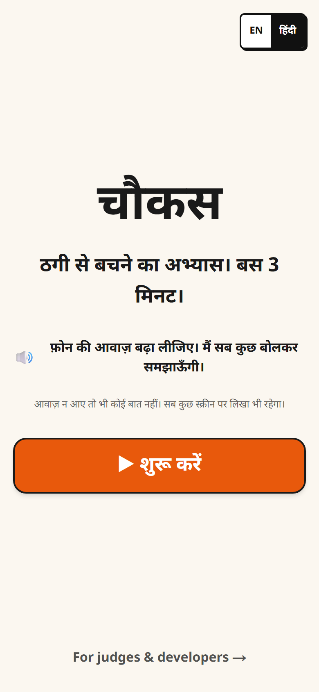
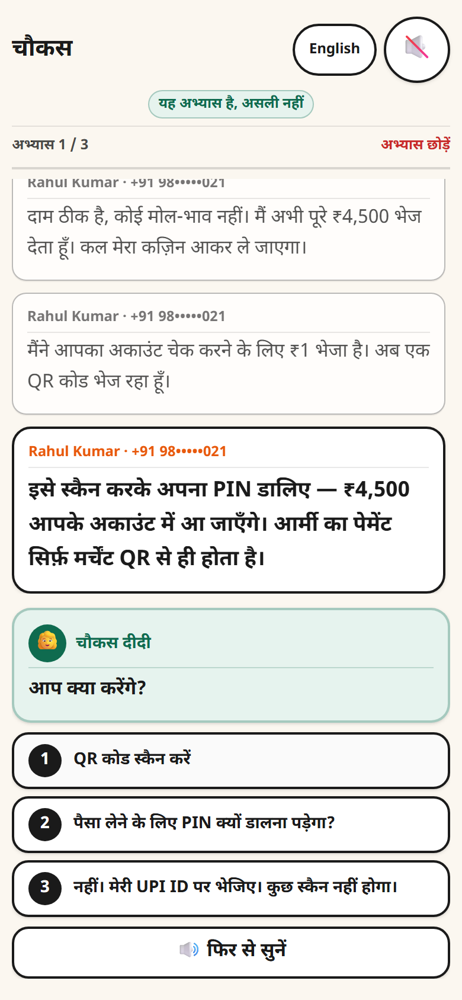
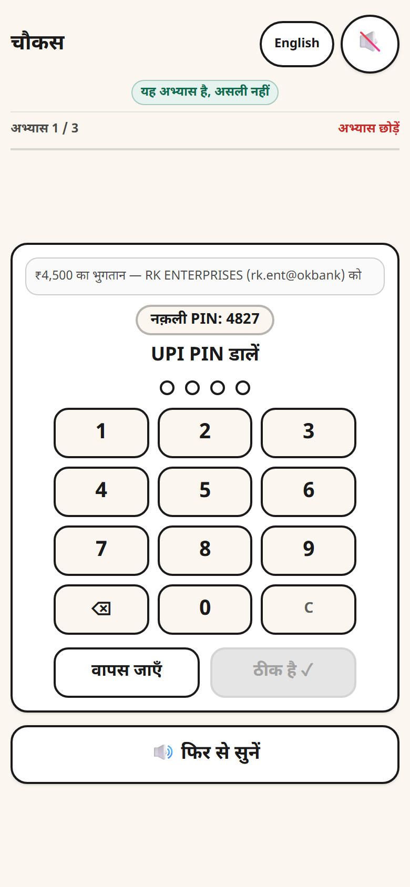
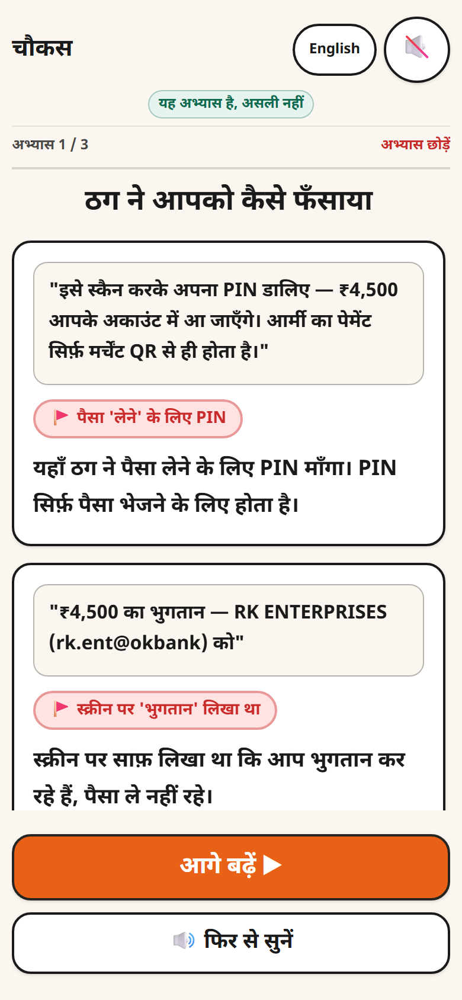
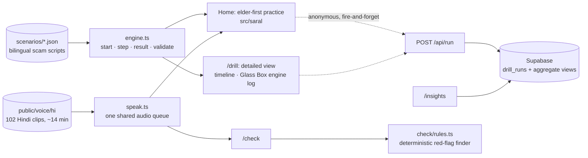

<div align="center">

# चौकस · Chaukas

### A scam fire-drill your parents can actually use

**यहाँ फँसिए, ताकि बाहर कभी न फँसें।** · Get scammed here, so you never are out there.


**[Open the live app →](https://chaukas.vercel.app)** &nbsp;·&nbsp; [For judges](https://chaukas.vercel.app/judge?lang=en) &nbsp;·&nbsp; [Live numbers](https://chaukas.vercel.app/insights?lang=en) &nbsp;·&nbsp; [Check a message](https://chaukas.vercel.app/check) &nbsp;·&nbsp; [Detailed view](https://chaukas.vercel.app/drill?lang=en)

Built in one day for **HACKDAY 1.0** (DECODEP) · 20 September 2026 · Theme: *Tech for a Better Tomorrow*

</div>

---

## In 30 seconds

- **The problem.** Most UPI-fraud victims are not hacked. Under fear and hurry they *send the money themselves*, even when they know the rule.
- **The idea.** Stop building detectors. Let people **rehearse the moment** in a safe sandbox: a pretend scammer messages or calls, the pressure builds, a PIN pad appears. What the person *does* is what gets measured.
- **Who it is for.** The people scammers target most. The app opens in **Hindi**, and a guide voice, *चौकस दीदी*, explains every screen, reads every message aloud and reads out every choice. One thing per screen, big numbered buttons, no timers, no jargon.

<!-- SCREENSHOTS: put these four phone screenshots in docs/screens/ with exactly these names. If you cannot add them, delete this table. -->
| Home | A message, read aloud | The PIN moment | The lesson |
|:---:|:---:|:---:|:---:|
|  |  |  |  |

## Try it

| If you have | Do this |
|---|---|
| 2 minutes and a phone | Open **[chaukas.vercel.app](https://chaukas.vercel.app)** with the **sound on**, tap ▶ शुरू करें, and go along with the buyer |
| A laptop | Open the **[detailed view](https://chaukas.vercel.app/drill?only=olx-qr&lang=en)**: the same practice with the engine log streaming beside it |
| A spam SMS on your phone | Paste it into **[/check](https://chaukas.vercel.app/check)** and hear the verdict |
| A terminal | `git clone`, `npm install`, `npm test` |

## The problem

UPI-related fraud in India: **13.42 lakh incidents worth ₹1,087 crore** in FY 2023-24, **12.64 lakh incidents worth ₹981 crore** in FY 2024-25, and **10.64 lakh incidents worth ₹805 crore** in FY 2025-26 up to November (Ministry of Finance reply in the Lok Sabha, reported 15 December 2025).

The payment rails are not being broken. **The victim authorises the payment.** When the Prime Minister warned the country about "digital arrest", he described the scammer's method in three moves: gather personal details, create fear, create time pressure. In that state people type the PIN or read out the OTP they would never share on a calm day.

So the gap is not knowledge. It is **behaviour under pressure**, and nobody gives people a place to rehearse it. We hold fire drills because people who "know" where the exit is still freeze.

## What Chaukas does

Three practices, two to three minutes each:

| Practice | The scam | The trap |
|---|---|---|
| The buyer who never bargains | "Scan this QR and enter your PIN to *receive* ₹4,500" | A PIN pad whose small print says **Paying** |
| Your power will be cut tonight | SMS → call → "install this app" → OTP | A screen-sharing permission, then the OTP |
| You are under digital arrest | Courier IVR → "inspector" on a video call → "RBI verification account" | Sending money to prove innocence |

Each practice is: **one yes/no question** (what the person *knows*) → **the scam itself** (what they *do*) → **the lesson**, in which the scammer's own lines are replayed and each trick is named, followed by the one rule to remember and what to do if it happens for real: call **1930**, then the bank.

After each practice the guide asks "one more, or enough for today?". At the end there is a plain score, a gentle note if the person *knew the rule and still fell*, and one green button: **send to family on WhatsApp**. Children forwarding it to parents is the distribution plan.

**/check** is the everyday companion: paste any suspicious message, see the pressure tactics highlighted in plain words, **hear** the verdict and the advice, and practise that exact scam. Nothing pasted ever leaves the device.

## Two rounds of outside feedback, in one day

**2 pm: "too complex."** The first interface was a phone simulator with a timeline replay and a live engine log. Testers, including developers, found it hard to use. If a developer hesitates, a 65-year-old cannot use it at all. The front door was rebuilt from a blank page around ten rules:

1. Hindi first on every visit; English is one tap away.
2. A guide voice explains every screen, with captions always visible.
3. One thing per screen; the main button is always at the bottom, never below the fold.
4. Buttons are full-width and at least 64px tall; choices carry a big 1 / 2 / 3 badge that matches the spoken "पहला, दूसरा, तीसरा".
5. Text is 20px or larger. No capitals, no jargon, no English-only labels.
6. A calm, familiar look, and choices are never colour-coded.
7. No timers or countdowns. The pressure comes from the scammer's words and voice, as it does in real life.
8. It is always obvious who is speaking: the guide (green bubble) or the other person (white bubble).
9. A permanent chip says "यह अभ्यास है, असली नहीं" (this is practice, not real).
10. Any tap stops the voice at once, and "🔊 फिर से सुनें" (hear again) is on every screen.

**3:30 pm: a blunt first-user review** scored the concept 9/10 and almost everything else between 1 and 4: a blank first screen on slow networks, no guidance about sound before pressing Start, a language switch that did not carry across pages, three different looks, links too small to tap, and an /insights page with nothing in it. Every point was fixed the same afternoon (commits `15:50`–`16:29` below):

- The home screen is now **server-rendered HTML**; it appears before any JavaScript loads, and no audio is fetched until the first tap.
- The home screen says what to expect about sound, and the first step is a **sound check** ("can you hear me?") with volume help and a live "sound is playing" indicator.
- **A double tap can no longer choose an option on the next screen**, a bug that silently walked careless tappers into the scam.
- **One language** for the whole site, Hindi by default on every visit, with `<html lang>` kept correct.
- **One design system** across every page, with a large "back to the practice" button everywhere.
- A real **/insights** page, and a **/check** an elder can use: one-tap paste, a button that always explains itself, a spoken verdict.
- An accessibility pass: sizes that respect the phone's font setting, large tap targets, focus rings, labelled controls, correct `lang` on mixed-language text.

The original interface is still there as the **detailed view** at `/drill`.

## The one number

**Knowledge–Behaviour Gap:** of the people who answered the rule correctly, the share who still fell for that scam on their first attempt. It is computed live from anonymous runs and always shown with its sample size on [/insights](https://chaukas.vercel.app/insights?lang=en), next to fall rate per practice, what people did, how long they hesitated at the keypad, how many red flags they walked past, and whether a second try went better. It is a self-selected hackathon sample, not a representative study, and the page says so.

## For judges

| Criterion | Where to look |
|---|---|
| Problem & Impact | The problem section above · the live gap on /insights · the family-forwarding loop |
| Innovation | Behaviour measured with real keypad traps instead of quiz answers · a voice-guided, elder-first flow · a lesson built from the lines the person actually heard |
| Technical implementation | `src/engine/engine.ts` (pure and deterministic) · scenario linter and bot players in `tests/` · the CI badge · the engine log in `/drill` · two interfaces on one engine |
| User experience | The home page, on a phone, with the sound on |
| Feasibility & Scalability | "Add a new scam" below · static hosting · the practices still complete with every network call failing |

## How it works



- **A deterministic core.** A pure TypeScript engine decides every outcome from what the person actually did: typed the PIN, shared the OTP, allowed the app. No AI sits in that path, so every user and every judge gets the same explainable result, instantly and offline. Two very different interfaces run on the same engine, which is the practical proof that logic and presentation are separate.
- **Scenarios are data.** Each scam is one JSON file. `validate()` proves in CI that every scenario has a scam ending, a safe exit from every node, both languages and at least three red flags. Two bot players, the most gullible and the most careful person possible, play every scenario on every push.
- **Voice that works on any phone.** Browser Hindi voices are unreliable (some browsers ship none), so every Hindi line is a pre-generated clip played through one shared audio queue. Browser speech is the English fallback; captions are the fallback for silence.
- **Nothing in the core needs a server.** Block every network request after the first load and all three practices still complete. Telemetry, insights and audio are optional layers that fail quietly.
- **An honest checker.** `/check` is a small, tested rules engine: scam recall 12/12 and false alarms 0/12 on the fixtures, which include genuine bank OTP messages. Its best verdict is "no red flags found", never "safe".

**Stack:** Next.js (App Router) · TypeScript · Tailwind CSS · Supabase (Postgres) · Vercel · GitHub Actions.

## Add a new scam in about twenty minutes

1. Copy a file in `src/scenarios/`; write the nodes, messages, choices and endings in English and Hindi; tag the red flags.
2. Add it to `src/scenarios/index.ts`.
3. Run `npm test`. The linter rejects broken graphs, missing translations, dead ends, and any scenario a careful player cannot escape.
4. Optional: drop Hindi clips into `public/voice/hi/` using the naming scheme in `docs/SARAL_UI_SPEC.md`. Missing clips fall back to browser speech.

No component changes. That is the scaling path: more scams, more languages, and the same engine embedded in a bank's or an NGO's onboarding.

## Privacy and safety

- Chaukas **never asks for a real PIN, OTP, phone number or bank**. People get a practice PIN, shown on the screen.
- Digits typed on a keypad **never leave the keypad component**. The engine's `Action` type only accepts their *length*. Nothing is stored, logged or sent.
- Telemetry is anonymous: scenario, outcome, timings, language, and whether the rule was known. There is no name, phone, email or IP column. The table has row-level security with no public policies; only the server can write, and only aggregates are ever read.
- Every screen is marked as practice, no real app's branding is imitated, and the helpline number is plain text, **not** a tappable call link, so nobody rings 1930 by accident.
- The scam scripts contain nothing beyond what public advisories already describe.

## Run it

```bash
npm install
npm run dev        # http://localhost:3000
npm test           # scenario linter + bot players + message-checker fixtures
npm run build
```

Node 22.6 or newer. Telemetry is optional: copy `.env.example` to `.env.local`, add a Supabase URL and secret key, then run `supabase/schema.sql` and `supabase/insights_v2.sql`. Without them the app runs normally and records nothing.

## Project map

```
src/engine/engine.ts      pure practice engine, scoring, scenario linter
src/scenarios/            the three scams as bilingual JSON
src/saral/                the elder-first, voice-guided practice (home page)
src/ui/                   the shared design system: shell, top bar, buttons, cards
src/app/drill/            the detailed view: timeline replay + Glass Box engine log
src/app/check/            message checker with one-tap paste and a spoken verdict
src/app/insights/         live, aggregate-only numbers
src/check/rules.ts        deterministic red-flag finder
src/lib/speak.ts          shared audio queue, clip playback, speech fallback
src/lib/useLang.tsx       one language for the whole site
src/app/api/              /api/run (telemetry in) · /api/insights (aggregates out)
public/voice/hi/          102 Hindi clips: guide, callers, every message, every choice
tests/                    bot players, graph validation, checker fixtures
docs/                     PRD · SARAL_UI_SPEC · QUALITY_PASS_V3 · VOICE_CREDITS
supabase/                 one table, two aggregate views, locked down
```

## The day, from the commit log

| Time (IST) | What happened |
|---|---|
| 09:59 – 10:23 | Scaffold, tested engine + three scenarios, first deploy |
| 10:41 | First practice playable end to end on the live URL |
| 10:59 – 12:26 | Keypad validation, anonymous telemetry, /insights, /check |
| 12:46 – 13:39 | Hindi caller voices, debrief and report, full Hindi interface |
| 14:11 | Hindi rendering fixed (letter-spacing was breaking the script) |
| **14:43 – 14:59** | **After tester feedback: a new elder-first, voice-guided front door becomes the home page** |
| **15:50 – 16:29** | **After a first-user review: seven fix packages, from the double-tap bug to a server-rendered home, one language, one design system, real /insights, elder-friendly /check, accessibility** |

## Honest limits

| Part | Status |
|---|---|
| Engine, scenario linter, scoring, tests | Works as described |
| Three scenarios | Follow public advisories; not yet reviewed by a cyber-crime cell or a bank fraud team |
| Elder-first interface | Designed, built and revised in one afternoon on the strength of a few testers; it needs proper sessions with older users, including screen-reader users |
| Voices | Synthetic placeholders under non-commercial licences (`docs/VOICE_CREDITS.md`); to be replaced by voice actors |
| Insights | A self-selected sample with soft rate limiting |
| `/check` | A small rules engine that misses unusual phrasing by design |
| "Video call" | An avatar and captions, no real video |
| Long-term fraud reduction | **Not claimed.** Research shows short interventions reduce susceptibility and that one-off training fades, which is why re-practice and family forwarding exist. A follow-up study is the next step |

**Next:** Punjabi and other languages · recorded human voices · an assisted mode for a child sitting beside a parent · more scams (AI voice-clone "family emergency", fake customer care) · a monthly nudge to practise again · pilots with banks, resident associations and cyber cells.

## Sources

- UPI fraud figures, Lok Sabha reply (Dec 2025): [The420](https://the420.in/india-upi-fraud-data-fy26-parliament-digital-payments/) · [Madhyamam](https://madhyamamonline.com/india/upi-linked-frauds-amount-to-rs-805-crore-far-fy26-govt-1477281)
- I4C advisory, agencies do not arrest over video call: [The Tribune](https://www.tribuneindia.com/news/india/cbi-ed-dont-nab-via-video-calls-advisory-to-curb-digital-arrest/)
- "No digital arrest in law; stop, think, take action", Mann Ki Baat, 27 Oct 2024: [Deccan Chronicle](https://deccanchronicle.com/nation/modi-do-not-get-digitally-arrested-1833524)
- PIN requests to "receive" money as a red flag: [PhonePe Business](https://business.phonepe.com/articles/fake-upi-payment-scams-how-to-identify-and-prevent-fraud)
- Burke, Kieffer, Mottola & Perez-Arce, *Can Educational Interventions Reduce Susceptibility to Financial Fraud?* ([PDF](https://gflec.org/wp-content/uploads/2021/04/Burke-Kieffer-Mottola-Perez-Arce-Can-Educational-Interventions-Reduce-Susceptibility-to-Financial-Fraud-CB2021.pdf))
- *Training consumers to detect digital imposter scams*, Journal of Financial Crime, 2025 ([link](https://www.emerald.com/jfc/article/32/1/77/1243133/What-does-trust-have-to-do-with-it-Training))
- ShieldUp!, an inoculation game for the Indian scam landscape ([arXiv 2503.12341](https://arxiv.org/html/2503.12341)) · ScamPilot ([arXiv 2601.22426](https://arxiv.org/html/2601.22426))

Design and decision records: [`docs/PRD.md`](docs/PRD.md) · [`docs/SARAL_UI_SPEC.md`](docs/SARAL_UI_SPEC.md) · [`docs/QUALITY_PASS_V3.md`](docs/QUALITY_PASS_V3.md)

## How this was built

Built on 20 September 2026 inside the HACKDAY 1.0 window, with AI coding assistance: Claude for the specification, engine, scenarios, voice pipeline and code review; an AI coding agent for the interface. Every file was run, tested and reviewed by the author, and the commit history shows the whole day, including both rebuilds that followed outside feedback.

<div align="center">

**If you or someone you know is targeted: call 1930 immediately and report at cybercrime.gov.in.**

</div>
